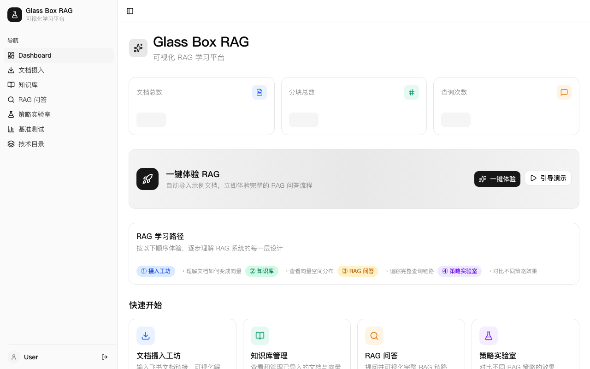
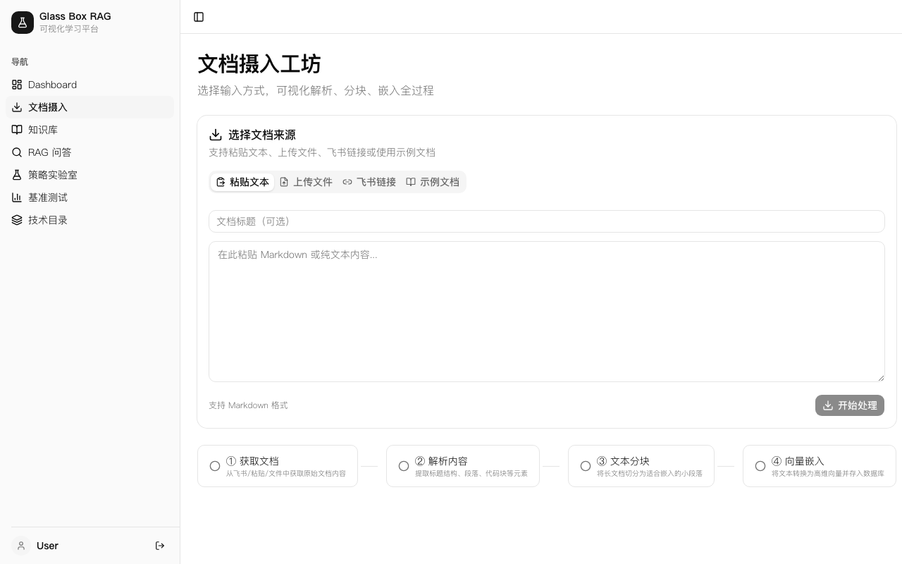
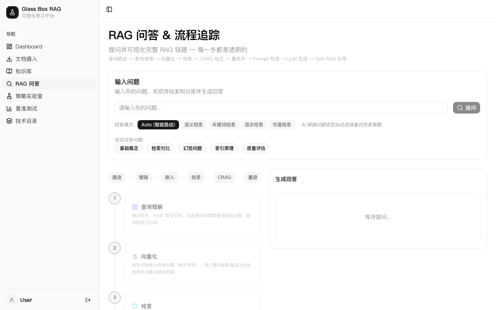
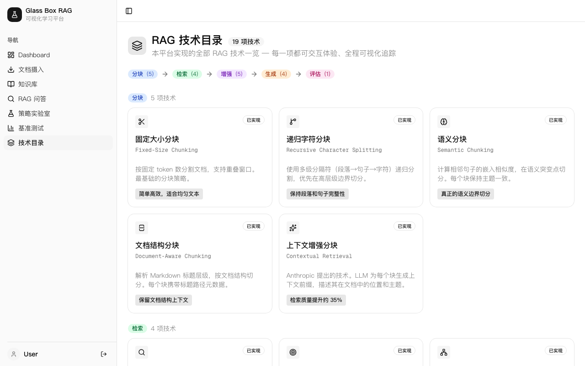

# Glass Box RAG — 可视化 RAG 学习平台

[](https://rag.rxcloud.group)
[](https://nextjs.org/)
[](https://supabase.com/)
[](https://open.bigmodel.cn/)
[](LICENSE)

> **"打开 RAG 的黑盒"** — 一个交互式学习平台，让你亲手操作并可视化 RAG 系统每一步的运作过程。

## Demo

**在线体验**: [https://rag.rxcloud.group](https://rag.rxcloud.group)

无需登录，打开即用。点击"一键体验"自动导入示例文档，立即开始 RAG 问答。

---

## 页面展示

### Dashboard — 学习入口



一键体验 RAG、学习路径引导、数据统计总览。

### 文档摄入工坊 — 理解文档如何变成向量



支持粘贴文本、上传文件、飞书链接、示例文档四种输入方式，可视化 4 步处理管道（获取 → 解析 → 分块 → 嵌入）。

### RAG 问答 & 流程追踪 — 9 步管道全透明



5 种检索模式切换、推荐问题快速体验、管道步骤卡片实时展示耗时与中间结果。

### RAG 技术目录 — 19 项技术一览



分块(5) → 检索(4) → 增强(5) → 生成(4) → 评估(1)，每项技术都可交互体验、全程可视化追踪。

---

## 核心特性

### Glass Box 可视化

每次查询都展示完整的 9 步 RAG 管道，每一步都透明可观：

```
查询路由 → 查询增强 → 向量嵌入 → 文档检索 → CRAG 校正 → 重排序 → Prompt 构造 → LLM 生成 → Self-RAG 反思
```

- **管道瀑布图** — 可视化各步骤耗时分布
- **费用估算表** — 每步 API 调用成本明细
- **引用溯源** — 回答中的 [1][2] 标注可追溯到原始文档块
- **质量评估** — RAG Triad (Faithfulness / Relevance / Completeness) 自动评分

### 教学功能

| 功能 | 说明 |
|------|------|
| **智能路由** | AI 自动分析问题类型，选择最优检索策略 |
| **CRAG 校正** | Corrective RAG — 自动评估检索质量，不足时重查 |
| **Self-RAG 反思** | 模型对自身回答进行段落级自省 |
| **GLM-5 老师分析** | 一键调用 GLM-5 对每步给出教学讲解 |
| **策略对比** | 在实验室中对比不同检索模式、增强器的效果差异 |

### 5 种检索模式

| 模式 | 说明 |
|------|------|
| Auto (智能路由) | AI 根据问题自动选择最优策略 |
| 语义检索 | 向量余弦相似度搜索 |
| 关键词检索 | PostgreSQL 全文搜索 (tsvector) |
| 混合检索 | 语义 + 关键词 RRF 融合 |
| 句窗检索 | 精确匹配 + 上下文窗口扩展 |

### 3 种查询增强器

- **Query Rewrite** — LLM 改写优化查询
- **HyDE** — 生成假设文档用于嵌入
- **Multi-Query** — 拆分为多个子查询并行检索

---

## 技术架构

```
┌─────────────────────────────────────────────────────┐
│                   Next.js 16 (App Router)           │
│  ┌─────────┐  ┌──────────┐  ┌──────────┐  ┌─────┐ │
│  │ 文档摄入 │  │  知识库   │  │ RAG 问答  │  │ 实验室│ │
│  └────┬────┘  └────┬─────┘  └────┬─────┘  └──┬──┘ │
│       └────────────┴──────┬──────┴────────────┘    │
│                           │                         │
│  ┌────────────────────────┴──────────────────────┐ │
│  │              RAG Pipeline Engine               │ │
│  │  Router → Enhancers → Embedding → Retrieval   │ │
│  │  → CRAG → Reranker → Generator → Self-RAG     │ │
│  └──────────┬────────────────────┬───────────────┘ │
└─────────────┼────────────────────┼─────────────────┘
              │                    │
    ┌─────────▼─────────┐  ┌──────▼──────┐
    │  Supabase + pgvector │  │  GLM-4-flash │
    │  (向量存储 + SQL)     │  │  (LLM 推理)   │
    └───────────────────┘  └─────────────┘
```

| 层 | 技术 |
|----|------|
| 前端 | Next.js 16, TypeScript, Tailwind CSS, shadcn/ui, Recharts |
| LLM | 智谱 GLM-4-flash (管道), GLM-5 (教学分析) |
| 向量数据库 | Supabase pgvector (1024d, HNSW 索引) |
| 嵌入模型 | 智谱 embedding-3 |
| 全文搜索 | PostgreSQL tsvector + GIN 索引 |
| 数据隔离 | Session Cookie UUID (免登录, 30 天有效) |
| 部署 | Vercel (Serverless Edge) |

---

## 项目结构

```
ai-rag-pipeline/
├── web/                          # Glass Box RAG 学习平台 (Next.js)
│   ├── src/
│   │   ├── app/                  # App Router 页面
│   │   │   ├── (dashboard)/      # Dashboard, 摄入, 知识库, 问答, 实验室
│   │   │   └── api/rag/          # RAG API 路由
│   │   ├── lib/
│   │   │   ├── rag/              # RAG 核心引擎
│   │   │   │   ├── query-router.ts         # 智能查询路由
│   │   │   │   ├── query-enhancers/        # Rewrite / HyDE / Multi-Query
│   │   │   │   ├── retrievers/             # Semantic / Keyword / Hybrid / Sentence-Window
│   │   │   │   ├── corrective-rag.ts       # CRAG 校正
│   │   │   │   ├── self-rag.ts             # Self-RAG 反思
│   │   │   │   ├── reranker.ts             # LLM 重排序
│   │   │   │   ├── generator.ts            # Prompt 构造 + 生成
│   │   │   │   ├── evaluator.ts            # RAG Triad 评估
│   │   │   │   └── teacher-analysis.ts     # GLM-5 教学分析
│   │   │   ├── llm/glm.ts                  # 智谱 GLM 模型配置
│   │   │   ├── embedding/zhipu.ts          # 智谱 Embedding
│   │   │   └── supabase/                   # 数据库客户端 + 认证
│   │   └── components/
│   │       ├── trace/            # TracePanel, 步骤详情, 教师分析
│   │       └── pipeline/         # 摄入管道可视化
│   └── supabase/migrations/     # 数据库迁移
│
├── src/                          # 后端 RAG Pipeline (Node.js)
│   ├── index.js                  # CLI 入口
│   ├── pipeline-orchestrator.js  # 三阶段编排器
│   ├── stages/                   # Clone → Clean → Upload
│   └── services/                 # Feishu, OpenAI, ES, MongoDB
│
└── tests/                        # Jest 测试 (70%+ 覆盖率)
```

---

## 快速开始

### 在线体验 (推荐)

直接访问 [https://rag.rxcloud.group](https://rag.rxcloud.group)，点击"一键体验"。

### 本地开发

```bash
# 1. 克隆项目
git clone https://github.com/kevinten-ai/rag-learning-platform.git
cd ai-rag-pipeline/web

# 2. 安装依赖
npm install

# 3. 配置环境变量
cp .env.local.example .env.local
# 填写: NEXT_PUBLIC_SUPABASE_URL, NEXT_PUBLIC_SUPABASE_ANON_KEY,
#       SUPABASE_SERVICE_ROLE_KEY, GLM_API_KEY

# 4. 启动开发服务器
npm run dev
```

### 后端 Pipeline (飞书文档采集)

```bash
cd ai-rag-pipeline
npm install
npm run pipeline -- --folders "folder1,folder2"
```

详见 [CLAUDE.md](CLAUDE.md) 中的完整命令参考。

---

## 数据库 Schema

```sql
collections (id, name, user_id, chunk_strategy, embedding_model, ...)
  └── documents (id, collection_id, user_id, title, raw_content, ...)
       └── chunks (id, document_id, collection_id, content, embedding vector(1024), fts tsvector, ...)

query_traces (id, user_id, question, config, trace, answer, sources, ...)
```

向量搜索通过 `match_chunks()` RPC 函数实现，使用 HNSW 索引 + 余弦相似度。

---

## 学习路径

按以下顺序体验，逐步理解 RAG 系统的每一层设计：

1. **文档摄入工坊** — 理解文档如何变成向量
2. **知识库管理** — 查看向量空间 3D 分布
3. **RAG 问答** — 追踪完整查询链路 (9 步管道)
4. **策略实验室** — 对比不同检索策略的效果差异

---

## License

ISC
